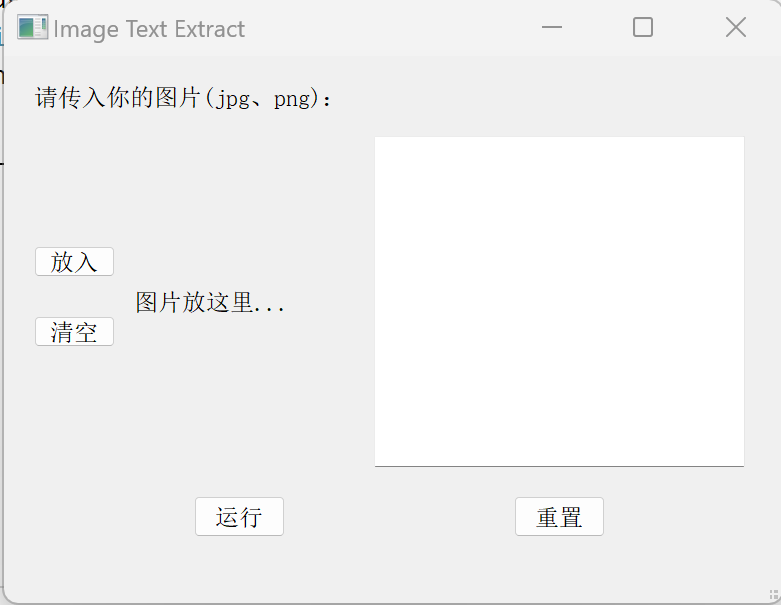
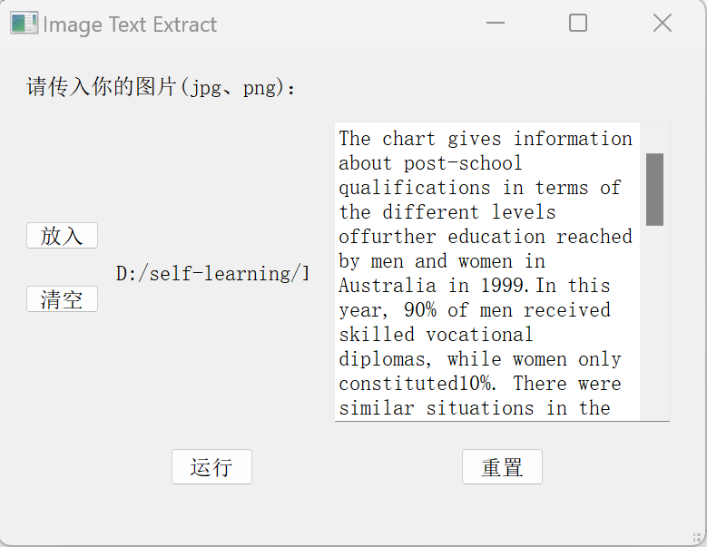

## 图像文字提取工具
----------
### 001 功能
1. 图像文字内容提取。借助Tesseract工具（OCR技术），实现图片文字识别与提取。
2. 为提高精确度，避免图像光照不均匀导致的识别误差，引入Retinex算法。Retinex是一种常用于图像增强的算法，其核心思想是在保留图像细节信息的前提下，调整图像的对比度和亮度。Retinex算法主要有三种不同的实现方式：单尺度Retinex（SSR）、多尺度Retinex（MSR）和多尺度自适应增益Retinex（MSRCR）。此处实现SSR方式。
3. 进一步预实现：图像裁剪技术，以获取图像的特定区域。

### 002 运行
运行当前目录下的main.py即可。

### 003 示例

